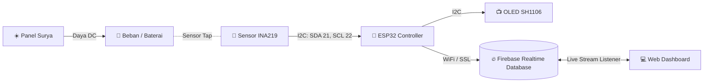

<div align="center">

  

  # ☀️ Monitoring Panel Surya (PLTS) - VEDC
  ### *Real-Time IoT Solar Energy Monitoring System with ESP32 & Firebase*

  <p align="center">
    
    
    
    
    
  </p>

  <p align="center">
    Sistem pemantauan daya Pembangkit Listrik Tenaga Surya (PLTS) berbasis Internet of Things (IoT). Membaca parameter tegangan, arus, dan daya secara real-time melalui sensor <b>INA219</b>, menampilkannya pada layar <b>OLED</b>, serta menyinkronkannya ke <b>Firebase Realtime Database</b> dan <b>Web Dashboard Interaktif</b>.
  </p>

  <p align="center">
    <a href="#-fitur-utama">Fitur</a> •
    <a href="#-skema-rangkaian--pinout">Skema Pin</a> •
    <a href="#-struktur-data-firebase">Struktur Data</a> •
    <a href="#-panduan-instalasi--penggunaan">Panduan Instalasi</a> •
    <a href="#-teknologi-yang-digunakan">Teknologi</a>
  </p>
</div>

---

## 🌟 Fitur Utama

<table>
  <tr>
    <td width="50%">
      <h3>⚡ Hardware & IoT (ESP32)</h3>
      <ul>
        <li><b>High-Precision Sensing:</b> Mengukur tegangan (V), arus (A), dan daya (W) menggunakan sensor <code>INA219</code> via komunikasi I2C.</li>
        <li><b>Dual Display:</b> Menampilkan status SSID, IP lokal, tegangan, arus, daya, dan status cloud di layar <code>OLED SH1106 (128x64)</code>.</li>
        <li><b>Cloud Sync:</b> Pengiriman data berkala ke Firebase Realtime Database menggunakan <code>Firebase_ESP_Client</code>.</li>
        <li><b>Auto-Reconnect:</b> Otomatis menghubungkan ulang ke WiFi jika koneksi terputus.</li>
      </ul>
    </td>
    <td width="50%">
      <h3>🌐 Web Dashboard Modern</h3>
      <ul>
        <li><b>Real-Time Live Telemetry:</b> Grafik dinamis (SVG) yang mengalir secara live dengan tab selector untuk Daya (W), Tegangan (V), dan Arus (A).</li>
        <li><b>Light & Dark Mode:</b> Dukungan tema gelap dan terang yang nyaman untuk semua kalangan.</li>
        <li><b>Glassmorphism UI:</b> Tampilan modern berbasis CSS vanilla tanpa dependency framework yang berat.</li>
        <li><b>Responsive Design:</b> Nyaman dibuka melalui Smartphone, Tablet, maupun PC/Laptop.</li>
      </ul>
    </td>
  </tr>
</table>

---

## 🏗️ Arsitektur Sistem



---

## 🔌 Skema Rangkaian & Pinout

Komunikasi antar modul menggunakan antarmuka **I2C (Inter-Integrated Circuit)** pada pin standar ESP32:

| Perangkat | Pin Modul | Pin ESP32 | Keterangan |
|---|:---:|:---:|---|
| **OLED SH1106G (128x64)** | `VCC` | `3.3V / 5V` | Sumber Daya |
| | `GND` | `GND` | Ground |
| | `SDA` | **`GPIO 21`** | I2C Data |
| | `SCL` | **`GPIO 22`** | I2C Clock |
| **Sensor INA219** | `VCC` | `3.3V / 5V` | Sumber Daya |
| | `GND` | `GND` | Ground |
| | `SDA` | **`GPIO 21`** | I2C Data (Paralel dengan OLED) |
| | `SCL` | **`GPIO 22`** | I2C Clock (Paralel dengan OLED) |
| | `Vin+` | `PV Positive (+)` | Masukan positif dari Panel Surya / Baterai |
| | `Vin-` | `Load Positive (+)` | Keluaran positif menuju Beban |

---

## 📊 Struktur Data Firebase

Data dikirimkan oleh ESP32 ke path **`/plts/current`** dalam format JSON sebagai berikut:

```json
{
  "voltage": 12.45,
  "current": 1.230,
  "power": 15.31,
  "ip": "192.168.1.100"
}
```

<details>
<summary><b>Lihat Penjelasan Field Data</b></summary>

- `voltage`: Tegangan panel surya dalam satuan Volt ($V$).
- `current`: Arus listrik yang mengalir dalam satuan Ampere ($A$).
- `power`: Daya listrik yang dihasilkan dalam satuan Watt ($W = V \times A$).
- `ip`: Alamat IP lokal ESP32 pada jaringan WiFi lokal.
</details>

---

## 📁 Struktur Direktori Proyek

```plaintext
solar-system-monitoring/
├── esp32/
│   └── monitoring_plts_firebase/
│       └── monitoring_plts_firebase.ino   # Firmware Arduino ESP32
├── public/
│   └── index.html                         # Single-page Web Dashboard
├── firebase.json                          # Konfigurasi Firebase Hosting
├── .firebaserc                            # Project Mapping Firebase
└── README.md                              # Dokumentasi Proyek
```

---

## 🚀 Panduan Instalasi & Penggunaan

### 1️⃣ Konfigurasi & Upload ESP32
1. Buka Arduino IDE dan pasang library berikut via **Library Manager**:
   - `Firebase ESP Client` by Mobizt
   - `Adafruit INA219` by Adafruit
   - `Adafruit SH110X` by Adafruit
   - `Adafruit GFX Library` by Adafruit
2. Buka file [`esp32/monitoring_plts_firebase/monitoring_plts_firebase.ino`](esp32/monitoring_plts_firebase/monitoring_plts_firebase.ino).
3. Sesuaikan konfigurasi WiFi dan kredensial Firebase:
   ```cpp
   const char* ssid     = "NAMA_WIFI";
   const char* password = "PASSWORD_WIFI";

   #define FIREBASE_API_KEY       "API_KEY_ANDA"
   #define FIREBASE_DATABASE_URL  "DATABASE_URL_ANDA"
   #define FIREBASE_USER_EMAIL    "EMAIL_USER_FIREBASE"
   #define FIREBASE_USER_PASSWORD "PASSWORD_USER_FIREBASE"
   ```
4. Hubungkan ESP32 ke PC melalui USB, pilih board **ESP32 Dev Module**, lalu klik **Upload**.

---

### 2️⃣ Deploy Web Dashboard ke Firebase Hosting
Pastikan Anda telah menginstal [Node.js](https://nodejs.org/) dan Firebase CLI (`npm install -g firebase-tools`).

1. Buka terminal pada folder root proyek:
   ```bash
   cd "solar system monitoring"
   ```
2. Login ke akun Firebase Anda:
   ```bash
   firebase login
   ```
3. Deploy file web ke Firebase Hosting:
   ```bash
   firebase deploy --only hosting
   ```
4. Buka URL hasil deploy yang muncul di terminal (misal: `https://monitoring-panel-surya-vedc.web.app`).

---

## 🛠️ Teknologi yang Digunakan

<div align="center">
  <table>
    <tr>
      <th align="center">Kategori</th>
      <th align="center">Teknologi / Library</th>
      <th align="center">Kegunaan</th>
    </tr>
    <tr>
      <td align="center"><b>Microcontroller</b></td>
      <td>ESP32 Dev Module</td>
      <td>Pemrosesan data sensor & pengiriman cloud</td>
    </tr>
    <tr>
      <td align="center"><b>Sensors & Display</b></td>
      <td>INA219 + SH1106G OLED</td>
      <td>Sensor daya I2C & tampilan visual lokal</td>
    </tr>
    <tr>
      <td align="center"><b>Cloud Backend</b></td>
      <td>Firebase Realtime Database</td>
      <td>Penyimpanan data real-time cloud</td>
    </tr>
    <tr>
      <td align="center"><b>Cloud Hosting</b></td>
      <td>Firebase Hosting</td>
      <td>Deployment web dashboard dengan SSL gratis</td>
    </tr>
    <tr>
      <td align="center"><b>Frontend Web</b></td>
      <td>HTML5, CSS3, JavaScript (ES6 Modules)</td>
      <td>Dashboard responsif, tema gelap/terang, live SVG chart</td>
    </tr>
  </table>
</div>

---

## 📜 Lisensi & Hak Cipta

© 2026 **VEDC**. Proyek ini dikembangkan untuk kebutuhan pemantauan efisiensi dan telemetri pembangkit listrik tenaga surya berbasis IoT.
